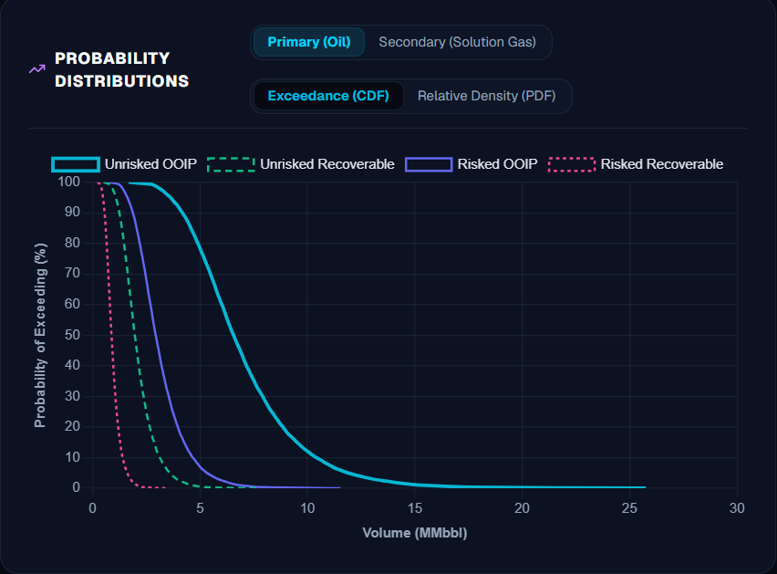
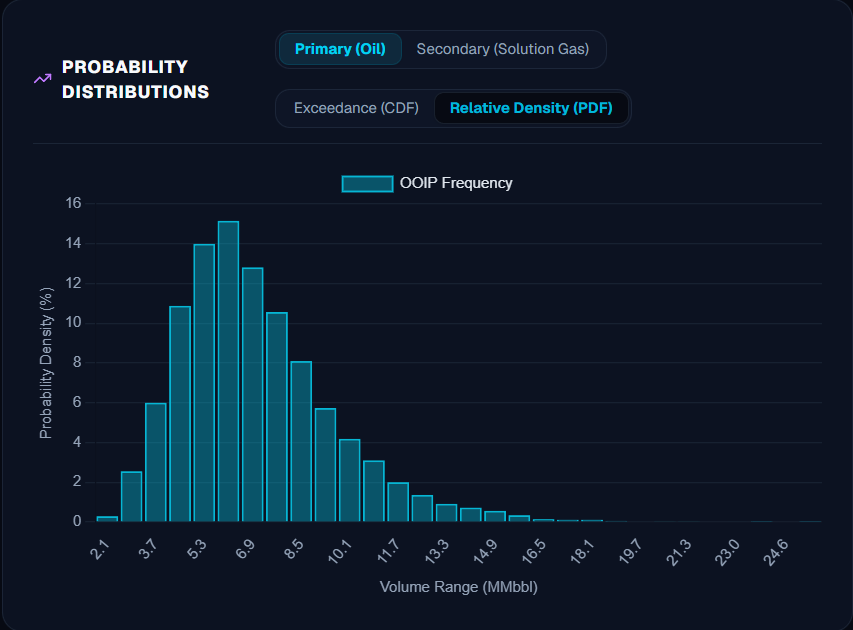
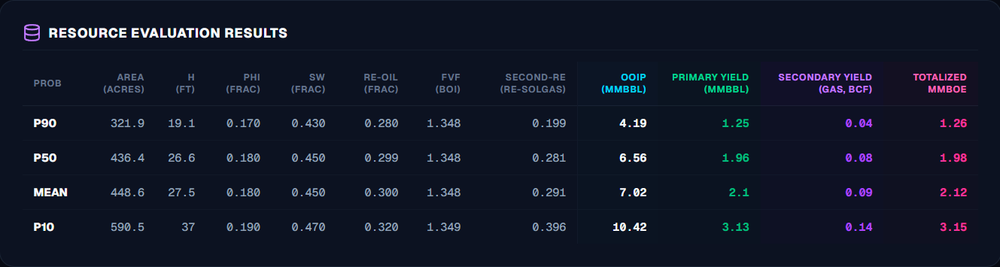
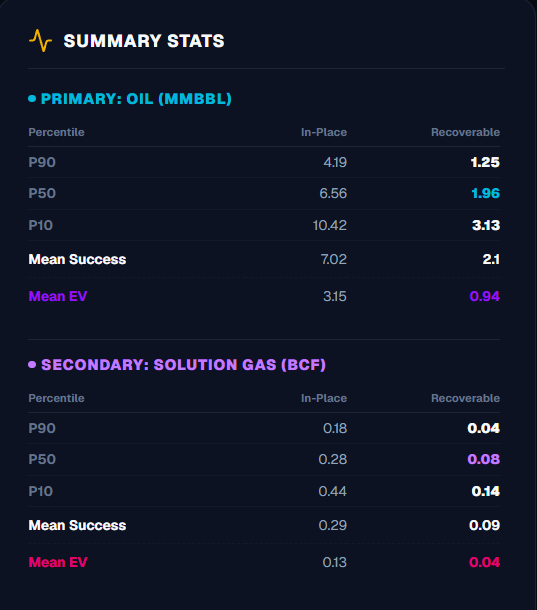

# ResoLogix

**Know Your Resources at First Place**


## Intro

ResoLogix is a full-range Resource Evaluation and Analytics Platform for Petroleum Resources, designed to be used by the Exploration and Production (E&P) companies in the Oil and Gas industry. It is used to manage the lifecycle of petroleum resources from discovery to production.








## Features

- Create and manage petroleum resources
- Manage the lifecycle of a petroleum resource from discovery to production
- Assess the risks associated with petroleum resources
- Visualize and draft reports of petroleum resources
- Estimate resources using Monte Carlo Simulation and Decline Curve Analysis (DCA)
- Create and manage simple resource models
- Estimate the economics of petroleum resources using Discounted Cash Flow (DCF) analysis
- Track and monitor petroleum resources
- Manage the lifecycle of petroleum resources (Pre-Drilling and Post-Drilling)


## Getting Started

First, run the development server:

```bash
npm run dev
# or
yarn dev
# or
pnpm dev
# or
bun dev
```

Open [http://localhost:3000](http://localhost:3000) with your browser to see the result.


## Tech Stack

### Core Framework & UI
- **Framework**: [Next.js](https://nextjs.org/) (App Router, React Server Components)
- **Language**: [TypeScript](https://www.typescript.org/) (Strict type-checking)
- **Styling**: [Tailwind CSS](https://tailwindcss.com/) (Premium custom dark/light theme support)
- **Icons**: [Lucide React](https://lucide.dev/)

### Data & Simulation
- **Database**: [SQLite](https://www.sqlite.org/) via `better-sqlite3` (Scenario & User management)
- **Computation Engine**: Custom Monte Carlo Simulation engine in TypeScript
- **Data Visualization**: [Chart.js](https://www.chartjs.org/) & [React-ChartJS-2](https://react-chartjs-2.js.org/) (Interactive Exceedance CDF & PDF curves)

### Backend & Reporting
- **Authentication**: [NextAuth.js](https://next-auth.js.org/) & `bcryptjs`
- **Email Service**: `nodemailer`
- **Report Generation**: `exceljs`, `docx`, `pdfkit`, `pptxgenjs`, `archiver`

## License

Apache 2.0