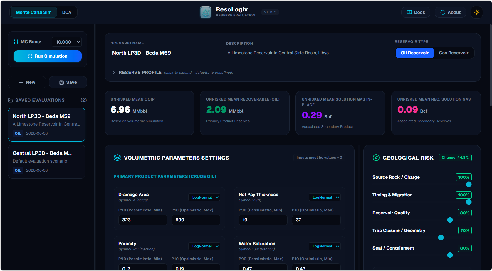

# ResoLogix

**Know Your Resources at First Place**


## Intro

ResoLogix is a full-range Reserve Evaluation and Analytics Platform for Petroleum Reserves, designed to be used by the Exploration and Production (E&P) companies in the Oil and Gas industry. It is used to manage the lifecycle of petroleum reserves from discovery to production.




## Features

- Create and manage petroleum reserves
- Manage the lifecycle of a petroleum reserve from discovery to production
- Assess the risks associated with petroleum reserves
- Visualize and draft reports of petroleum reserves
- Estimate reserves using Monte Carlo Simulation and Decline Curve Analysis (DCA)
- Create and manage simple reserve models
- Estimate the economics of petroleum reserves using Discounted Cash Flow (DCF) analysis
- Track and monitor petroleum reserves
- Manage the lifecycle of petroleum reserves (Pre-Drilling and Post-Drilling)


## Getting Started

First, run the development server:

```bash
npm run dev
# or
yarn dev
# or
pnpm dev
# or
bun dev
```

Open [http://localhost:3000](http://localhost:3000) with your browser to see the result.


## Tech Stack

### Core Framework & UI
- **Framework**: [Next.js](https://nextjs.org/) (App Router, React Server Components)
- **Language**: [TypeScript](https://www.typescript.org/) (Strict type-checking)
- **Styling**: [Tailwind CSS](https://tailwindcss.com/) (Premium custom dark/light theme support)
- **Icons**: [Lucide React](https://lucide.dev/)

### Data & Simulation
- **Database**: [SQLite](https://www.sqlite.org/) via `better-sqlite3` (Scenario management)
- **Computation Engine**: Custom Monte Carlo Simulation engine in TypeScript
- **Data Visualization**: [Chart.js](https://www.chartjs.org/) & [React-ChartJS-2](https://react-chartjs-2.js.org/) (Interactive Exceedance CDF & PDF curves)


## Resources

- [Next.js Documentation](https://nextjs.org/docs) - learn about Next.js features and API.
- [Learn Next.js](https://nextjs.org/learn) - an interactive Next.js tutorial.
- [Tailwind CSS](https://tailwindcss.com/) - a utility-first CSS framework.
- [SQLite Documentation](https://www.sqlite.org/docs.html) - documentation for the self-contained SQL database engine.
- [Chart.js](https://www.chartjs.org/docs/latest/) - a JavaScript library for producing dynamic, interactive data visualizations.


## License

Apache 2.0